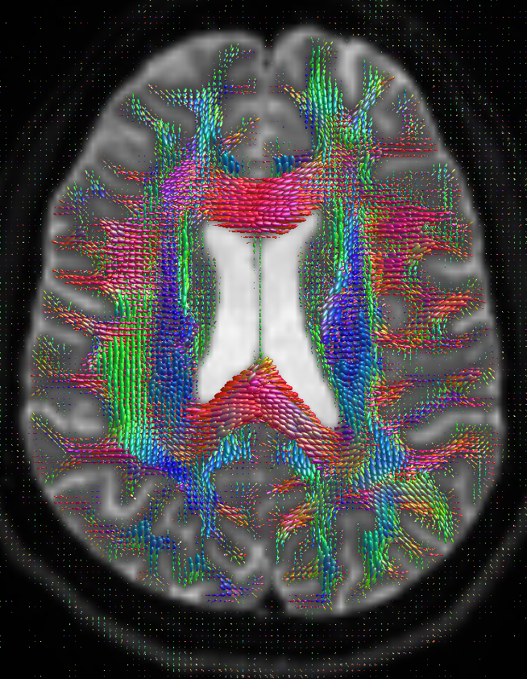
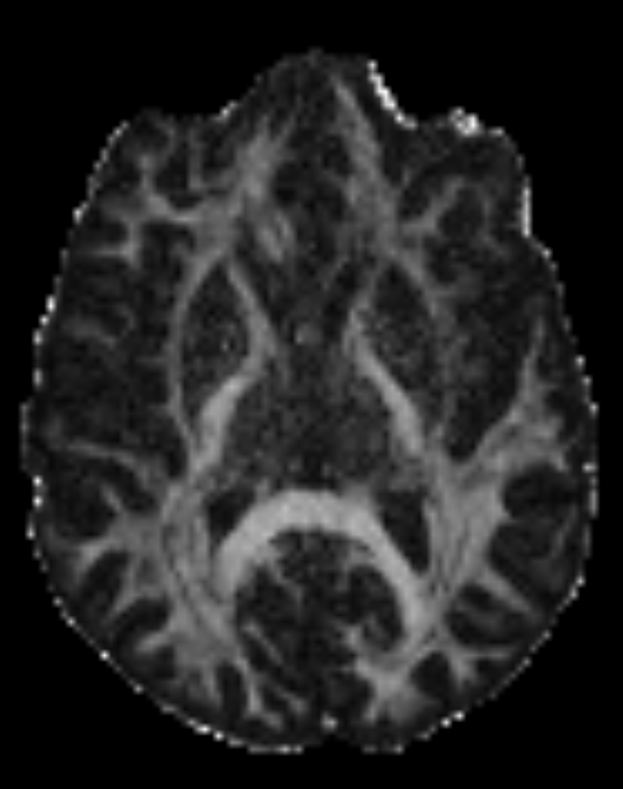
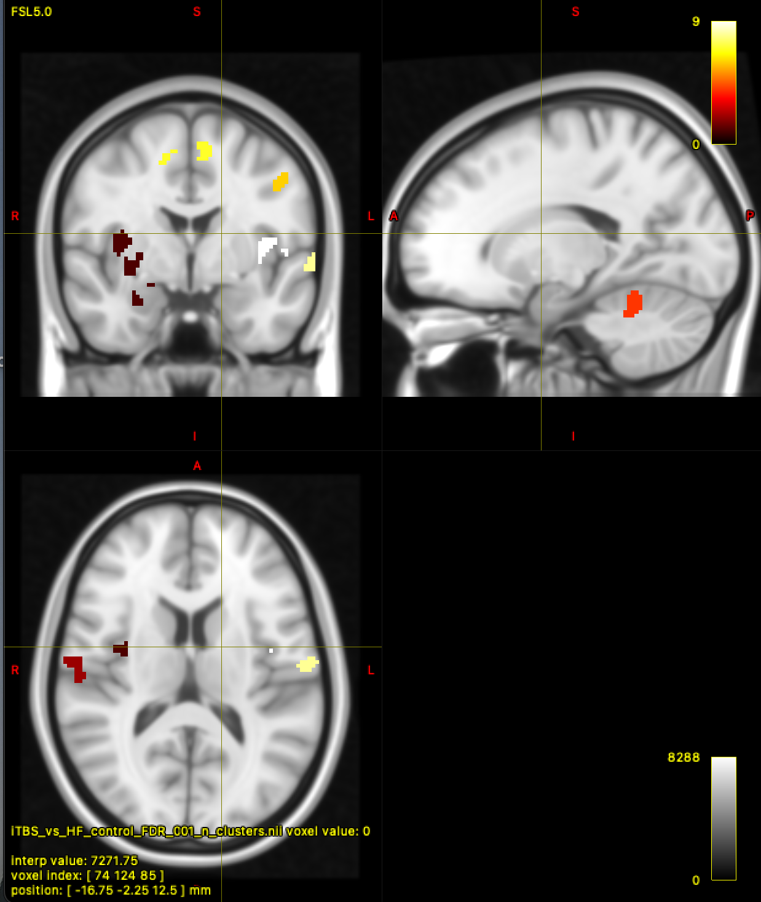
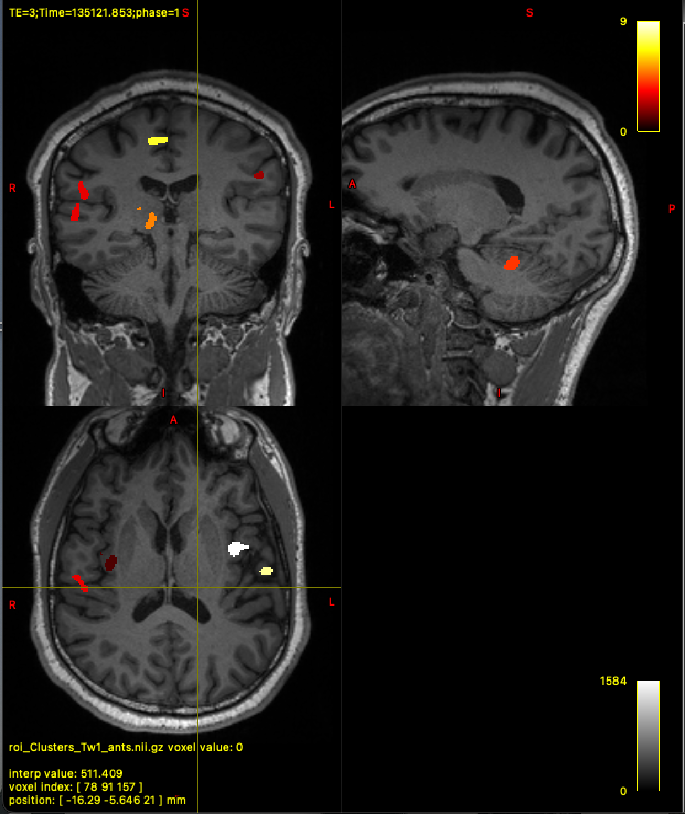
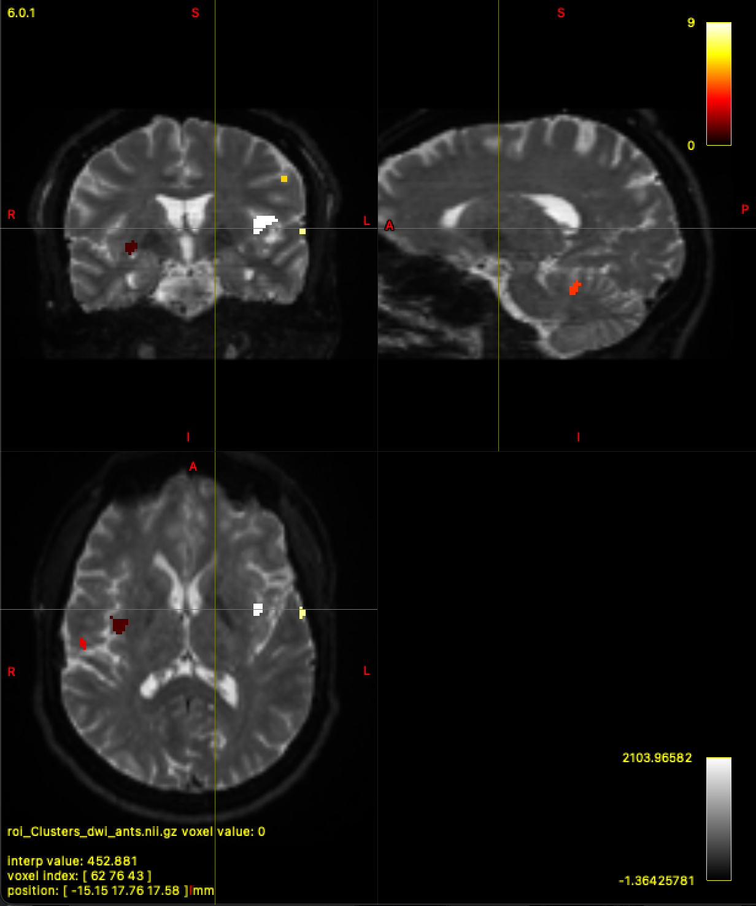
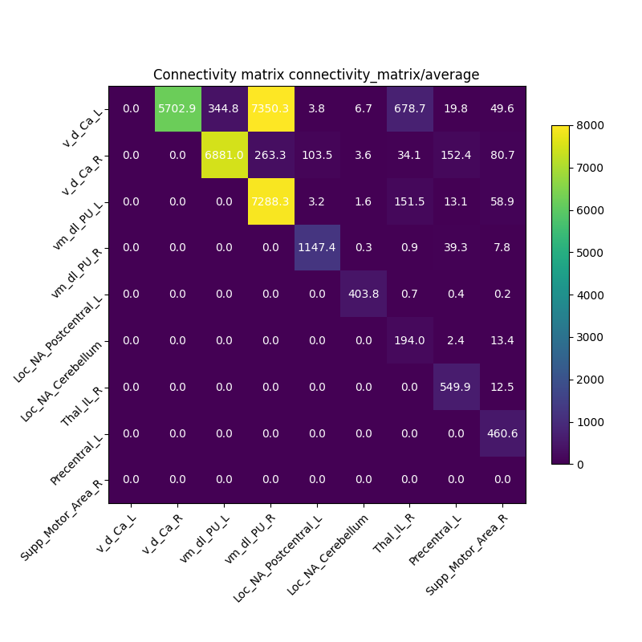

# UPHUMMEL Imaging: DWI Pipeline

The pipeline is designed to process diffusion-weighted imaging data. It consists of six processing steps: 
- 01: Copying the files locally 
- 02: DWI preprocessing 
- 03: Lesion transplantation to anatomical imaging 
- 04: FreeSurfer parcellation 
- 05: Anatomical registration for DWI, lesion imaging, and average template
- 06: DWI processing, including tractography algorithms (FOD and FA files)

It also provides the files needed to proceed with ROI-to-ROI and seed-based analyses using the following steps:
- 11: Register ROIs from MNI to B0 space
- 12: Extract specific tracts from the whole-brain tractography according to the ROIs
- 13: Seed-based analysis script for the striatum as the seed (caudate, putamen, left and right split)
- 14: Statistical correlation with behavioral data  

## Get The Code
You can get the repository by cloning from gitlab with the following commands:

```
cd existing_repo
git remote add origin https://gitlab.epfl.ch/ebeanato/uphummel_imaging_template.git
git branch -M main
git push -uf origin main
```

## Run The Pipeline
To run the code from the terminal: 

```
cd uphummel_imaging_template
cd 1_structural-diffusion
bash 000_main_dwi_pipeline.sh -s desired_subject -t desired_session
```
*For TBI data, the subject id. is formated as 51T0# and the unique session done is baseline.

# Getting started - Adapte the pipeline to your data and paths
The `uphummel_imaging_template` folder contains two subfolders:

- `0_general`: This folder contains the code to format the data into BIDS format.
- `1_structural-diffusion`: This folder contains the code to process and analyze DWI data.

Regarding the `1_structural-diffusion` folder, to use the processing pipeline, you should run the `000_main_dwi_pipeline.sh` file. At the beginning of this file, there are a few parameters that you can adjust to suit your own machine and data.

1. **Paths**: All paths in the pipeline are set to retrieve the data from `/mnt/Hummel_data/TI/51T`. This can be changed by modifying the value of the variable `data_path`. The `local_path` defines where the processed data will be output under a `derivatives` folder. Finally, `server_path` defines the server where the processed data will be saved, which in this case is `/mnt/Hummel_data/TI/51T`. 

2. **Data specificity**: You can process brain imaging containing lesions by setting the `lesion` variable to `True`.

3. **Choice of steps**: For preprocessing/processing steps, you can select the ones needed for your analysis by using the variable `work` and setting the index of the desired step to `1`. If you need to perform intersubject analysis using an average template, you can set the variable `MNI` to `True` to register DWI data on an average brain template.

4. **Saving to server**: As explained, a function is available to save the final processing, FreeSurfer, and other processing results to the data server by setting the variable `save_to_server` to `True`. As a precaution, it is advisable to use this option at the end, once all the results are available on the running server.

5. Throughout the code, you should ensure that your paths correspond to those used. Note that I never use the files related to lesions, MNI, or copying data locally.


## Library and installation
The project requires the following libraries: 
- argparse
- logging
- os
- json
- shutil
- subprocess
- time
- nibabel 
- numpy
- itertools
- datetime 
- pandas
- csv

And to have FSL (v6), freeSurfer (v6), ANTS (2.4.3) and MRtriX

/!\ if you encounter problem with on of the library make sure that the path to the command is well set. 

For ANTS it doesn't find easly the commands used during the registration. We need ants for 2 functions: 
- 'antsRegristationSynN' which is called using bash and a sh file, make sure to set the right path in the antsRegristationSynN.sh file with this line: 

```
export ANTSPATH=${ANTSPATH:="[path to ants bin]"}
``` 

- 'antApplyTransforms' that will be found if we set the path directly on the ~/.bash_profil file as follow:
    - The file is found is the home directory.
    - It's a hidden file, to find it : ls -a
    - Open and edit it by using command vi
    ```
    cd ~
    vi .bash_profile
    ```
    - Put the following line 
    ```
    PATH=$PATH:$HOME/.local/bin:$HOME/bin:/opt/ants-2.4.3
    ```
    - Then save and exit vim 
    - You will may need to source the current directory to the bash_profile typping in terminal of the directory:
    ```
    source ~/.bash_profile 
    ``` 

## Steps and Ouputs 
All the output will be found in the derivatives folder according to the following structure.

```
Data_folder
└───derivatives
    └───01_analysis
    └───01_dwi
        └───sub-51T##
            └───baseline
                └───anat
                └───dwi
                    └───preproc
                    └───proc
                └───warps
        └───sub-51T##
        ...
    └───01_freesurfer
        └───fsaverage
        └───sub-51T#
            └───baseline
        ...
    └───01_mni
    └───01_tracts
        └───roi2roi
        └───seed-based
└───sub-51T##
└───sub-51T##
...
```
- 01_dwi groups everything regarding the dwi preprocessing and processing until the step 06 included. 
- 01_freesurfer is the free surfer parcellation output (step 04).
- 01_mni contains the area of interest on MNI template need for the analysis.
- 01_tracts the output of the roi2roi and seed-based analysis.
- 01_analysis the csv file used for statistical analysis and it outputs

### 1 - Copy The Data Locally
***Work index: 0*** \
***Call the file 01_copy_data_locally.py*** 

### 2 - DWI preprocessing
***Work index: 1*** \
***Call the file 02_dwi_preprocessing.py*** 

- Remove Gibbs Ringing Artifacts: \
(FSL) Degibbs step use the command: 
```
mrdegibbs [ filename ] in out
```

- Extracting b0s: \
(MRtrix) b0 images: the least-diffusion-weighted images or non-diffusion-weighted images, meanning the images with negligible diffusion weighting.


- Brain extractor Tool \
(FSL)
Deletes non-brain tissue from an image of the whole head. It can also estimate the inner and outer skull surfaces, and outer scalp surface, if you have good quality T1 and T2 input images. The FSL command is: 

```
bet [ filename ]
```

- Running topup
    - Calculate the susceptibility distortions and imporve B0-field homogeneity.
    - Use /eddy/acqparams.txt file \
(FSL) use the command:
```
topup --imain= b0s_filename --datain= acqparams_file --out= topup_out --config=b02b0.cnf --subsamp=1
```
- Running eddy 
    - Very computationally intense application. If GPUs are avaible use: eddy_cuda command (See documentation: https://fsl.fmrib.ox.ac.uk/fsl/fslwiki/eddy/UsersGuide#The_eddy_executables.)
    - use /eddy/acqparams.txt and /eddy/eddy_index.txt files
    - (FSL) use the command  
    ``` 
    eddy_openmp --imain= dwi_ap_degibbs_filename --mask= b0s_mean_brain_filename --index= args.index_file --mb=2 --acqp= acqparams_file --bvals= bals.bval --topup= topup_out.topup --bvecs= bvec.bvec --out= eddy_out --data_is_shelled" 
    ```
    - it updates .bvec file
        
- Bias field correction
    - Improve brain mask estimation
    - (FSL) use the command for fast debias and apply debias.
```
fast -t 2 -n 3 -H 0.1 -I 4 -l 20.0 -b -o biasField_out b0s_mean_brain_file

fslmaths eddy_folder_out -div biasField_out.nii.gz  folder out
```   

- Mean B0 \
mean B0 computation using the corrected image.

- Brain extractor on mean B0 \
(FSL)
Deletes non-brain tissue from an image of the whole head. It can also estimate the inner and outer skull surfaces, and outer scalp surface, if you have good quality T1 and T2 input images. The FSL command is: 

```
bet [ filename ]
```

Non-used file are moved to preproc/trash until removing them definitly.

### 3 - Lesion Transplantation
***Work index: 2*** \
***Call the file 03_lesionTransplantation_anat.py*** \
Record the Lesion on the image. Not needed for TBI patients.

### 4 - Free surfer Parcellation
***Work index: 3*** \
***Call the file 04_freesurfer.py*** \
Output the parcellation for the cortical and deep brain area.
Note that, depending on the freesurfer vesion used, the command for deep brain area parcellation change: 
```
segmentBS.sh subj-sess freesurfer_folder #FOR FREESURFER v 7
recon-all -s  subj-sess -brainstem-structures" #FOR FREESURFER v 6
```

Additionnaly you need to add manually the files: *lh.hcpmmp1.annot*, *rh.hcpmmp1.annot* and *hcpmmp1_ordered.txt* in the folder 01_freesurfer/fsaverage/labels, otherwise some output file will be corrupted. You might enconter persmission problems but you can create your own fsaverage folder and copy all the contante + the additionnal files into it.

### 5 - Registration
***Work index: 4*** \
Each registration has its own script. The scripts are called in 00_main_dwi_pipeline.sh using the varriable *work*, *lesion* and *MNI*

**/!\ - Theory:** 
The registration constists of 2 steps: 
First build up the warp which contains the transformation between the two spaces of interest. Its done by the antsRegistrationSyN_cmd command that takes as input 2 files of references (one for each space). Then, applying the transformation to the image that you want to register. It's done by antsApplyTransforms_cmd. Those two commands can be found in tools/registration_ants.py

#### 1. DWI registration
***Call the file 05_anat_registration_dwi.py***

- On dwi file compute, if not done, mean b0 and bet
- On Tw1 file ouput the brain extration (bet command), and segmentation into tissue type ["CSF", "GM", "WM"] (fast command)
- register Tw1 to b0 
- register Tw1 tissue types to b0 \
----> *Need to have run freesurfer here*
- use the free surfer segementation (aparc+aseg+bss) to register freesurfer to Tw1
- register freesurfer segementation (aparc+aseg) to dwi
- register freesurfer segmentation (aparc+aseg+bss) to dwi
- register freesurfer segmentation (wmparc) to TW1 space
- register freesurfer segmentation (wmparc & wmparc+bss) to dwi space

#### 2. Lesion registration
***lesion= True*** \
***Call the file 05_lesion_registration.py*** \
*0nly if the variable lesion is set "True" in the 000_main_dwi_pipeline.sh file.*
Not used for TBI patients. To complete

#### 3. MNI registration
***MNI = True*** \
***Call the file 05_Tw2MNI_reg.py*** \
*Only if MNI is set "True" in the 000_main_dwi_pipeline.sh file.*
Not used for TBI patients. To complete

### 6 - DWI: Fiber Orientation Estimation
***Work index: 5*** \
***Call the file 06_dwi_processing.py*** 

#### 1. dwi2response msmt_5tt
Estimate response function(s) for spherical deconvolution
(MTriX) 

```
dwi2response msmt_5tt input_file tt5_file respWM_filename respGM_filename respCSF_filename  -fslgrad bvec.bvec bval.bval -nthreads 8
```

*/!\ Warning message while processing:*
dwi2response:[WARNING] Command 5ttcheck indicates minor problems with provided input 5TT image
5TTcheck [warning] Image « 5TT.mif » conatins 27469 brain vixels with non-unity sum of partial volume fractions
5TTcheck [warning] Input image does not perfectly conform to 5TT format, but may still be applicable (suggest re-running using the -mask option to see voxels where tissue fractions do not sum to 1.0)
[warning] these may or may not interfere with the dwi2response mst_5tt script
-> not important 

#### 2. dwi2fod msmt_csd command 
Estimate fibre orientation distributions from diffusion data using spherical deconvolution. (take into account the all fiber population in sherical corodinate to solve better the cross-section and fibers orientation)

```
dwi2fod msmt_csd -mask t1_mask_filename input_file respWM_filename fodWM_filename respGM_filename fodGM_filename respCSF_filename fodCSF_filename -fslgrad bvec_filename bval_filename -nthreads 8
```
#### 3. tckgen
Perform streamlines tractography. The maximum number of streamline is set to 10000000. The aim is to get Fiber Orientation Distributions (FOD)

```
tckgen fodWM_filename streamlines_filename -algorithm iFOD2 -seed_image wm_pve_filename -select max_streamlines_count -force -minlength -nthreads 8
```
We are using the iFOD2 tacking algorithm: Second-order Integration over Fiber Orientation Distributions. A probabilistic algorithm that takes as input a Fiber Orientation Distribution (FOD) image represented in the Spherical Harmonic (SH) basis. Candidate streamline paths (based on short curved “arcs”) are drawn, and the underlying (trilinear-interpolated) FOD amplitudes along those arcs are sampled. A streamline is more probable to follow a path where the FOD amplitudes along that path are large; but it may also rarely traverse orientations where the FOD amplitudes are small, as long as the amplitude remains above the FOD amplitude threshold along the entire path. (From: https://mrtrix.readthedocs.io/en/dev/reference/commands/tckgen.html)

#### 4. Sift2
Optimise per-streamline cross-section multipliers to match a whole-brain tractogram to fixel-wise fibre densities. Output a .txt file contening weights for each fiber.

```
tcksift2 -act tt5_file -out_mu out_mu -out_coeffs out_sift_coeffs -nthreads 8 streamlines_filename fodWM_filename out_1M
```

***Call the file 06_compute_scalar_maps.py*** 
This scrpit aims to compute the Fractional Anisotropy. Its a index of diffusion direction. 0 value meaning that there is no preferential direction of diffusion, 1 that there is a strong direction preference for diffusion, high FA value are features of healthy well organized white matter. Here we use dtifit command to fit diffusion tensor model at each voxel that outputs : 
- basename_V1 - 1st eigenvector 
- basename_V2 - 2nd eigenvector 
- basename_V3 - 3rd eigenvector 
- basename_L1 - 1st eigenvalue 
- basename_L2 - 2nd eigenvalue 
- basename_L3 - 3rd eigenvalue  
- basename_MD - Mean Diffusivity 
- basename_FA - Fractional anisotropy 
- basename_S0 - raw T2 signal with no diffusion weighting \
as following  : 

```
dtifit --data= dwi_file --out= dwi_out_proc --mask= bet_file --bvecs= bvec_dwi_file --bvals= bval_dwi_file
```

___
**END OF THE PROCESSING**
___

At the end of this step you should have to start the analysis.
- sub-51T##_ses-##_iFOD2.tck : all brain tractogram
- sub-51T##_ses-##_sift.txt : wieghts associated to the streamlines
- sub-51T##_ses-##_fod.nii.gz : vectors of the direction of the diffusion

<div align="center">
   
</div>

- sub-51T01_ses-baseline_dwi_FA.nii.gz : Fractional anisotropy

<div align="center">
  
</div>


**SANITY CHECK** : 
On the FODi  file check if the vector are well alligned. Some region are easy to check for exemple the region that laying on the ventricles.


### 7 - ROI-to-ROI analysis and seed based-analysis
The ROI-to-ROI analysis consists of defining regions of interest and analyzing a reduced whole-brain tractography by selecting tracts that pass exclusively through the region(s) of interest. For the seed-based analysis, it involves selecting a region, called the seed, and exclusively selecting all the streamlines that pass through it.

*The folder 'masks' contains the mask used to restrict the tractography. The folder tracts_tckedit, the restrected tractography.

**ROI to ROI analysis :** \
We need to define the ROIs. We can take different approaches.  Here to define the ROIS we will use the result from **Wessel, M.J., Beanato, E., Popa, T. et al, 2023 nat. neuroscience**
to selecte area for which they have noticed a increase of activity compare to baseline (readout = fmri). Namely those area are : \
    - Loc_NA_Postcentral_L \
    - Loc_NA_Cerebellum \
    - Thal_IL_R \
    - Precentral_L \
    - Supp_Motor_Area_R 

Other approach suggested could be for exemple to take the motor network area from meta analysis. 

 This scrpit is done to take the fist approach presented but you can adapt the scrpit provided. The varriables that need to be change can be found at the front of the files.

1. registration: \
***Work index: 6*** \
***Call the file 11_register_roi_MNI2B0.py*** \
The first step is to register the voxels into the dwi space. Depending on which space the voxels are originally register the files needed for this step will be different.  
Here the ROIs are register in MNI space.

    /!\ : Notice that the striatum is not included in the files ClusterRois, it needs to be register individually. Only putaman left and right and caudate left and right are taken into accound (NAC neglected for the moment). This is done in 11_register_roi_MNI2B0.py

    *MNI template of the rois are found under derivative/sub/ses/01_mni. 

**SANITY CHECK:** \
You can check if the registration worked using mrviewer.
- Put as a template MNI template and overlay it with roi cluster in the MNI space (original file) then compare with the B0 space template with roi cluster in B0 space. Should be at the "same" anatomical place. 
- register the MNI ref file to the target space with the same transformation and wheck if the result overlay well with the reference file of the target space.


The masks register on different space : MNI, anatomical TW1, and B0.

<div align="center">
   
</div>
<div align="center">
   
</div>
<div align="center">
   
</div>

2. Create parcellation : \
***Work index: 7*** \
***Call the file 12_create_parc.py*** 
- Need individual mask from clusters: use fslmaths with treashold to select only one labels from the cluster file \
```
fslmaths roiClusters_file -thr (label - 0.1) -uthr (label + 0.1) -bin mask_file 
```

- Need global mask with all the area of interest: lump all the area of interest and label them again with operation on the data using the module nibabel.  \
* Nice to save the labels to be able to recover them once you will got the connectivity matrix.

**SANITY CHECK:** \
You can check if the parcellation using mrviewer. Open a ref file and overlay with the mask file. you can use the function treshold to see which label correspond to which area. 

3. Select tracks according to ROIs : \
***Work index: 8*** \
***Call the file 13_dwi_extract_tacts_tckedit.py***
- Select the streamlines that pass by 2 ROIs. (AND operation!) 
 
#### 1. tckedit 
Editing operations on track files to select track passing by 2 ROI eclusively. (AND operation) use the option -include to retrict to multiple area.
```
tckedit tck_file tck_out_file -include roi_file1 -include roi_file2 -tck_weights_in sift_file -tck_weights_out sift_outpath
```
output .tck file with the streamline selected and .txt file that contain their weights (sift).

**-end_only OPTIONS** 
tckedit has one option that allow to select the tracts that start and end in the two region of interest. It has not been use, but can be usefull in the case when lot of fibers pass by this area.

#### 2. tck2connectome 
One full parcellation (mask with all the area of interest) compute the weights between the areas selected.
prior to it need to groupe all the ROI on a global mask (parcellation_file). 
```
tck2connectome tck_file parcellation_file connectome -tck_weights_in sift_file -out_assignments assignments
```
output connectom.csv file which contains the matrix of connectivity between rois. 
The connectome is based on the number of streamlines as it use the full-brain tractograme (tck_file) and weight of streamlines (sift_file). The metrics in the matrix is the sum of streamline weights.

At the end of the file, tck2conn4stream.py functions are called to extract additionnal metrics. This file is a helper that can be found in tools folder.

**tck2connectome note about tract selection**
Compared to tckedit, tck2connectome does not have an option for tract selection, so determining which tract belongs to which area is not always clear. We do not get the same output matrix when we sum the weights of the streamlines selected by tckedit as we do with tck2connectome. Moreover, even when feeding tck2connectome with tracts extracted using ROI-to-ROI tckedit and applying the global mask, we do not exclusively find the connectivity of the ROIs concerned. It may compute the tract belonging differently then when we do :
- tckedit: selection of one tract
- sift: extraction of the weight of the streamline concerned
- summing the weights

Thus to use carefully to avoid misinterpretation.

**Seed-based analysis** \
***Work index: 8*** \
***Call the file 13_seed_based.py*** \
Seed selection : \
    - Striatum \
    - Putamen and Caudate \
    - Putamen left, putamen right, Caudate right , Caudate left 
same work flow than for the the ROI-to-ROI but only one ROI register for the streamline selection.

At the end of the file, tck2conn4stream.py functions are called to extract metrics. This file is a helper that can be found in tools folder. 
___
**END OF THE SEED-BASED AND ROI2ROI**
___

The main outputs of this analysis are the connectivity matrices. For the seed-based analysis, the `tck2connectome` function outputs a single value for each seed region, indicating how much the seed is connected to the rest of the brain. 

The ROI-to-ROI analysis results in a connectivity matrix (upper triangular) that provides an index of connectivity for each pair of ROIs. To visualize this matrix, you can use the functions `connectivity_matrix` and `print_connect_matrix`, which are in the file `tools/tck2conn4stream_measures.py`. The server does not have the necessary package (`matplotlib`) to run these functions, but you can load the CSV file you are interested in and apply the function locally, which will give you a clear visualization. Here is an example using the averaged connectivity matrix across all subjects:


<div align="center">
   
</div>


For the seed analysis the 4 index of connectivity (for each seed) are output into 4 distinct csv files. 
In order to do further analysis the file tools/formate_data.py provides functions to formate and groupe all those values into csv files with the right area labeled. The output will be find in the 01_analysis folder.

### 8 - Behavorial data correlation 
***Work index: 10*** \
***Call the file 14_foramte_data.py and 14_GLM.R*** 
Using the metrics of connectivity the idea is to correlate with the behavior. 
For the dataset used, the behaviaral data consists of the difference of gain under the two conditions (with stimulatio and without).
We will use a GLM, assuming that y ~ Normal(x_i). 
To do this part two files are provided the first one formate the data used for the statistical analysis and the R file build up the GLM model and extract ANOVA and Plot. 
All the output of this part will be found in the folder 'derivatives'/'01_analysis'. 


### Error Management and Step Tracking
Use fail-list files and try, except module to not break the flow and report the error fails and time. (Ignored by git push)

One .json file is output for each processing step according to the following template.

```
'Origin function': executed_command,
'Description': 'description of the command',
'Output file': name of the output file associated,
'Time' : when the command was done
```

### Usefull: 

1. Some parts are very ressources and time consumming, you could be bring ot run the code by night. If using a server and to prevent the deconnexion you can use screens, it will create a "room" that remains activate and openned even if you shut down your terminal/laptop. Here some usefull commands to manage screens.

- Create a screen: 
```
screen -S screen_name 
```
- go out of the screen: cmd A D
- go in again: 
```
screen -r screen_name 
``` 
- close the session: from the inside write exit on the terminal then enter
- list the existing screen: screen -ls

2. Might be usefull to check the labels of an image/mask
```
print('_________CHECK_______')
file =  os.path.join(#pathtodata)
img = nib.load(file)
data = img.get_fdata()
unique_labels = np.unique(data)

print('FILE', file', file, 'LABELS', unique_labels)
```